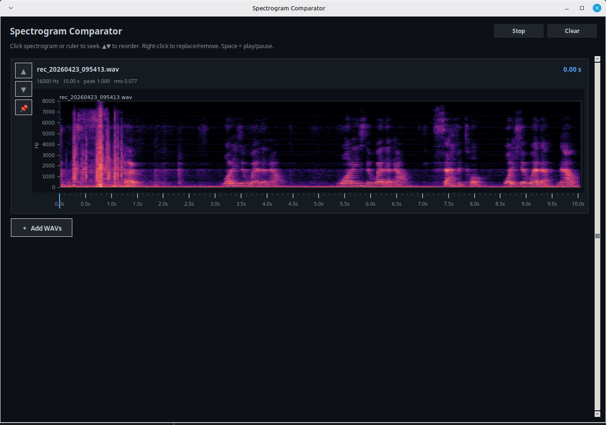

# tools

Utility GUIs for inspecting and comparing audio experiment outputs.

---

## Spectrogram Comparator

Dark-themed desktop GUI. Load any number of WAV files, view their spectrograms side-by-side, click to seek, and play audio inline.



### Features

- Load multiple WAV files at once (or add more without clearing)
- Click any spectrogram or the time ruler to seek to that position
- Space bar to play/pause the selected clip
- Pin a reference file to the top so it stays visible while you scroll
- Reorder panels with ▲ ▼
- Right-click a panel to replace or remove it
- Shows sample rate, duration, peak, and RMS per file

### Quick start

```bash
# 1. create and activate a virtualenv
python3 -m venv .venv
source .venv/bin/activate      # Windows: .venv\Scripts\activate

# 2. install dependencies
pip install -r requirements.txt

# 3. run (opens a file-picker dialog if no files are given)
python -m spectrogram_comparator

# 3b. pre-load files directly
python -m spectrogram_comparator path/to/a.wav path/to/b.wav
```

### Controls

| Action | How |
|---|---|
| Seek | Click spectrogram or time ruler |
| Play / Pause | Space bar, or click a panel |
| Stop | `Stop` button |
| Add files | `＋ Add WAVs` button (appends, doesn't clear) |
| Clear all | `Clear` button |
| Reorder | ▲ ▼ buttons on the left of each panel |
| Pin reference | 📌 button — panel moves to a fixed top area |
| Replace file | Right-click → Replace… |
| Remove file | Right-click → Remove |

### Dependencies

| Package | Purpose |
|---|---|
| `matplotlib` | Spectrogram rendering (TkAgg backend) |
| `numpy` | Audio array math |
| `sounddevice` | Real-time audio playback |
| `soundfile` | WAV decoding |

All are pure-Python / wheel installs — no system audio libraries needed beyond what `sounddevice` pulls in (PortAudio).

### Troubleshooting

**No audio output on Linux** — install PortAudio:
```bash
sudo apt install libportaudio2
```

**`_tkinter` not found** — install Tk:
```bash
sudo apt install python3-tk
```
